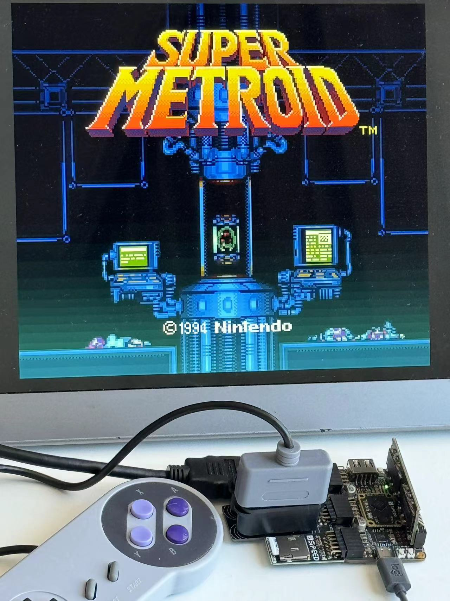

# SNESTang - SNES for Sipeed Tang FPGA Boards

  

SNESTang is an open source project to recreate the Super Nintendo Entertainment System (SNES) with the affordable Sipeed Tang FPGA boards. Currently [Tang Primer 25K](https://wiki.sipeed.com/hardware/en/tang/tang-primer-25k/primer-25k.html), [Tang Mega 60K](https://wiki.sipeed.com/hardware/en/tang/tang-mega-60k/mega-60k.html), [Tang Nano 20K](https://wiki.sipeed.com/hardware/en/tang/tang-nano-20k/nano-20k.html) and [Tang Mega 138K Pro](https://wiki.sipeed.com/hardware/en/tang/tang-mega-138k/mega-138k-pro.html) are supported.

* 720p HDMI output.
* Cycle accurate gameplay.
* Supports LoROM, HiROM and ExHiROM.
* ROM loading from MicroSD with an easy-to-use menu system, powered by a RISC-V softcore.
* Extension chips: DSP-1/2/3/4, S-RTC, OBC-1.
* Automatic BSRAM backup and restore.
* SNES or DS2 controllers.

SNESTang is part of [TangCore](https://github.com/nand2mario/tangcore), along with [NESTang](https://github.com/nand2mario/nestang), [GBATang](https://github.com/nand2mario/gbatang) and [MDTang](https://github.com/nand2mario/mdtang).

## Setup Instructions

For Tang Console (60K and 138K), follow the [TangCore](https://github.com/nand2mario/tangcore) installation instructions. For Tang Mega, Primer and Nano, please download a standalone [SNESTang release](https://github.com/nand2mario/snestang/releases) and follow instructions inside.

## Usage

Basic operations
* .SFC and .SMC roms should be automatically recognized.
* SELECT-RIGHT BUTTON to open OSD.

Backup SRAM support
* Many SNES gamepaks include battery-backed SRAM chips to store game saves, for example Super Mario World. Since 0.5, SNESTang supports fully-automatic backup and restore of BSRAM content, with no interruption to the game play.
* The function is by default turned off. To use it, first enable it in options. Then launch a game with BSRAM support. Every 10 seconds, SNESTang will check if there's new BSRAM content, and if yes saves it into `/saves/<rom_name>.srm`. BSRAM is also automatically restored at game launch if the corresponding .srm file exists, and BSRAM function is on.
* [List of games](https://www.dkoldies.com/blog/complete-list-of-snes-games-with-save-batteries/) with save batteries.

Core Switching
* If you create a /cores directory in your SD card and put the relevant .bin files of SNESTang and [NESTang](https://github.com/nand2mario/nestang) there, you will be able to switch between the two cores without connecting the board to your PC. Just choose "Select core" in the main menu and follow the instructions.

## Development

[Building TangCore from the source](https://nand2mario.github.io/tangcore/dev-guide/building/)

Read the updated [design notes](doc/design.md) to understand the code or to add features.

You can also simulate the code with [our verilator harness](verilator). `src/test_loader.v` specifies which rom is used by the simulation. Then `make sim` will start a SDL-based graphical simulation.

Upcoming feature that I may work on,

* [SNAC](https://boogermann.github.io/Bible_MiSTer/hardware/io-board/#serial-io) native controller adapter support.

## Special Thanks

* [SNES_FPGA](https://github.com/gyurco/SNES_FPGA) by Sergiy Dvodnenko (srg320) and gyurco. SNESTang is a port of this core for MiSTer and MIST.
* [hdl-util/hdmi](https://github.com/hdl-util/hdmi) by Sameer Puri.

nand2mario (`nand2mario at outlook.com`)

Since 2024.1
