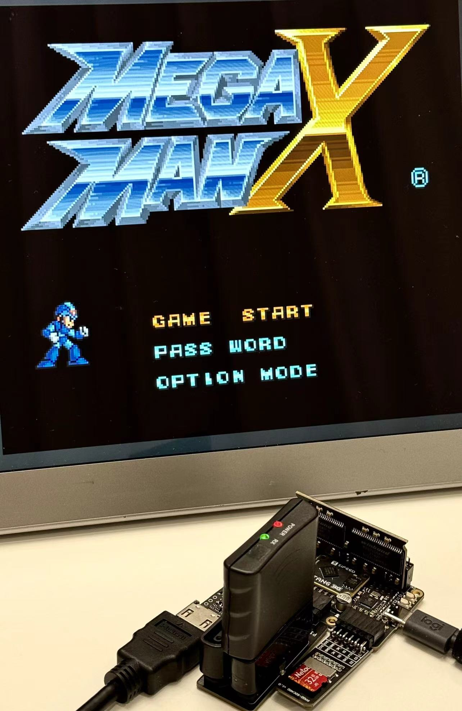

# SNESTang - SNES for Sipeed Tang Primer 25K FPGA Board

  

SNESTang is an open source project to recreate the Super Nintendo Entertainment System (SNES) with the tiny Sipeed Tang Primer 25K FPGA board. 

* 720p HDMI output.
* Cycle accurate gameplay.
* Supports LoROM, HiROM and ExHiROM.
* ROM loading from MicroSD with an easy-to-use menu system.
* Extension chips: DSP-1/2/3/4, S-RTC, OBC-1.
* Automatic BSRAM backup and restore.

Also check out the sibling project, [NESTang](https://github.com/nand2mario/nestang).

## Setup Instructions

Detailed [step-by-step instructions](doc/installation.md).

Quick instructions for experienced users:
* Get a Tang Primer 25K with 4 modules: Tang sdram, DVI, Dualshock2, SD and a pair of dualshock controllers. Currently these should cost ~$60 in total. Plug in the modules as shown above. Also make sure the sdram module is in the right direction (The side labeled "this side faces outwards" should face away from the board).
* Download a [SNESTang release](https://github.com/nand2mario/snestang/releases), and program `snestang.fs` to the board with Gowin programmer.
* Since 0.3, a firmware program also needs to be programmed to the board. Program `firmware.bin` to address `0x500000` of the on-board flash. See [this screenshot](doc/images/programmer_firmware.png) for how to do it.
* Put your .sfc or .smc roms on a MicroSD card. Note that 0.2 and earlier version only support FAT32. 0.3 and later supports FAT16, FAT32 and exFAT.
* Connect one or two DualShock2 controllers to the DS2 pmod.
* Insert the MicroSD card, connect an HDMI monitor or TV, and enjoy your games.

The project is still in early stages and some games do not work. Here are a few games that work well for me: Super Mario World, Gradius III, Contra III and MegaMan X. Find more information on the [game compatibility page](https://github.com/nand2mario/snestang/wiki/Game-Compatibility).

## Usage

Basic operations
* .SFC and .SMC roms should be automatically recognized.
* SELECT-RB (right button) to open OSD.

Backup SRAM support
* Many SNES gamepaks include battery-backed SRAM chips to store game saves, for example Super Mario World. Since 0.5, SNESTang supports fully-automatic backup and restore of BSRAM content, with no interruption to the game play.
* The function is by default turned off. To use it, first enable it in options. Then launch a game with BSRAM support. Every 10 seconds, SNESTang will check if there's new BSRAM content, and if yes saves it into `/saves/<rom_name>.srm`. BSRAM is also automatically restored at game launch if the corresponding .srm file exists, and BSRAM function is on.
* [List of games](https://www.dkoldies.com/blog/complete-list-of-snes-games-with-save-batteries/) with save batteries.

## Development

I am developing with Gowin IDE 1.9.9 Pro version. It requires a free license. Just open the project file snestang_primer25k.gprj.

Read the updated [design notes](doc/design.md) to understand the code or to add features.

You can also simulate the code with [our verilator harness](verilator). `src/test_loader.v` specifies which rom is used by the simulation. Then `make sim` will start a SDL-based graphical simulation.

## Special Thanks

* [SNES_FPGA](https://github.com/gyurco/SNES_FPGA) by Sergiy Dvodnenko (srg320) and gyurco. SNESTang is a port of this core for MiSTer and MIST.
* [hdl-util/hdmi](https://github.com/hdl-util/hdmi) by Sameer Puri.

nand2mario (`nand2mario at outlook.com`)

Since 2024.1
