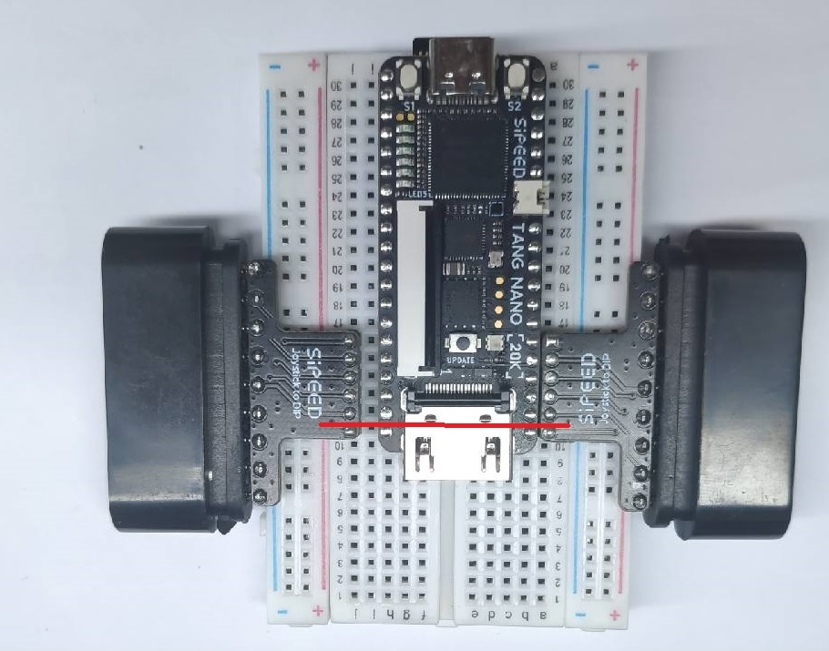
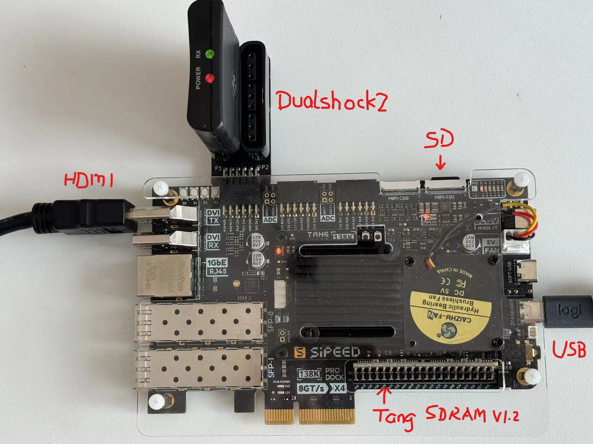
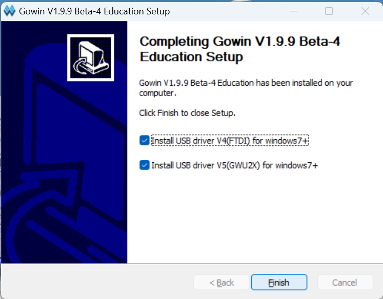
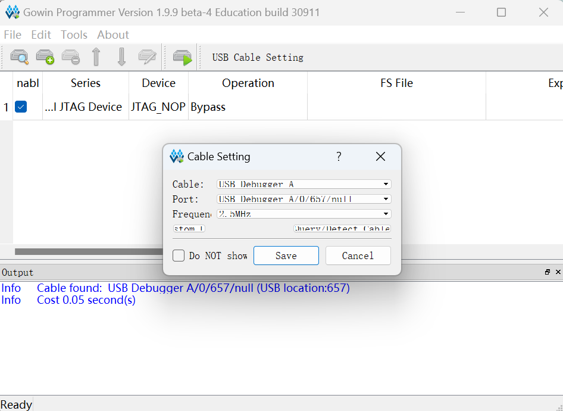
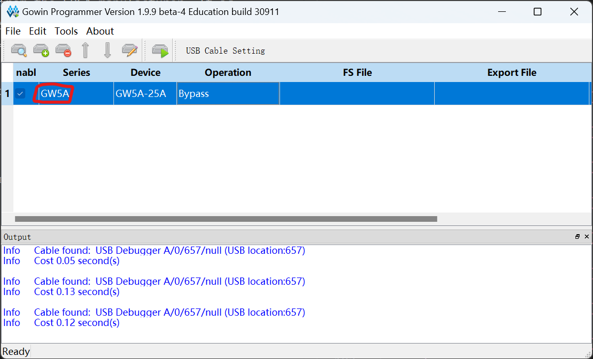
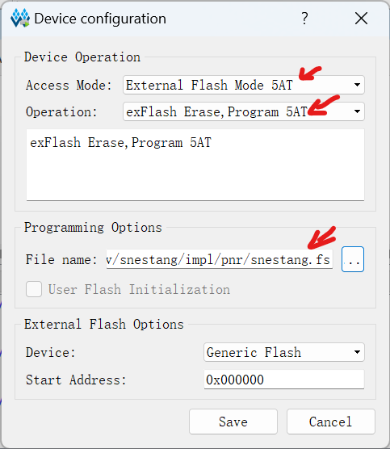
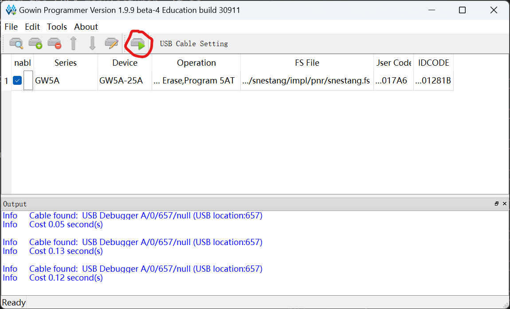
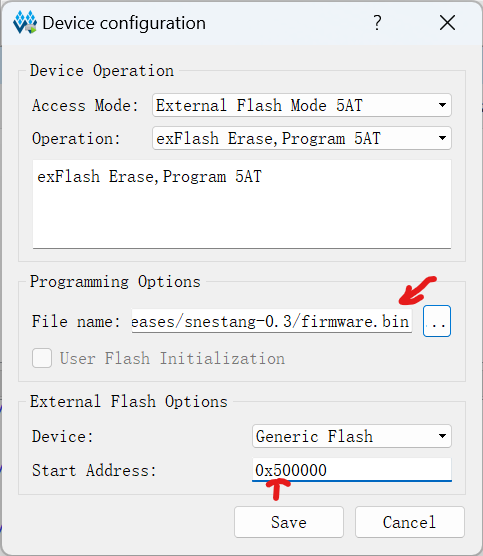
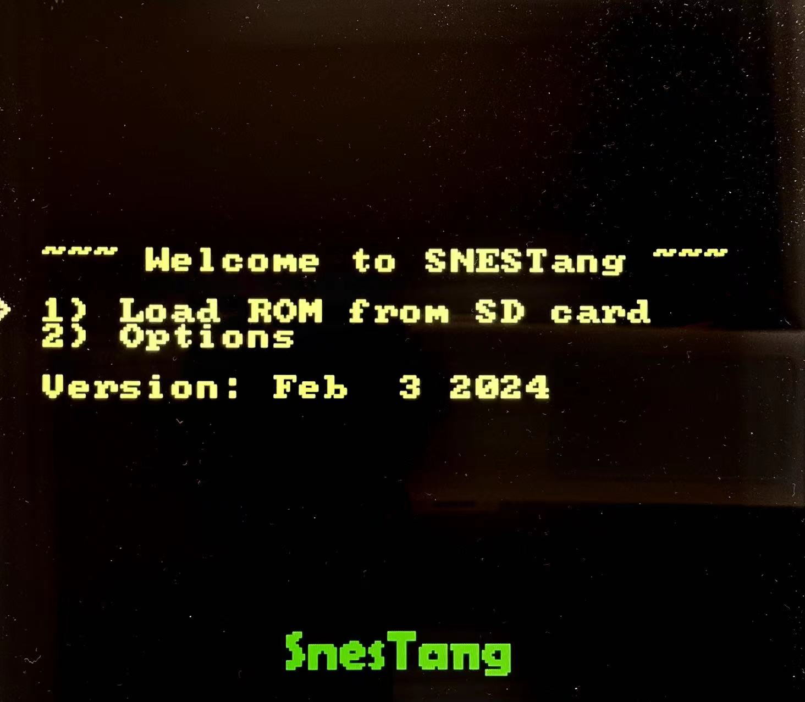

# SNESTang/NESTang Installation Instructions

This is a step-by-step guide to install SNESTang 0.6, NESTang 0.9 and later versions for the following FPGA boards.

* **Sipeed Tang Primer 25K dock**. This setup also requires Sipeed Tang SDRAM module, Sipeed Tang DVI pmod, TF-Card pmod and DS2x2 pmod.
* **Sipeed Tang Nano 20K**, along with game controllers and adapter boards sold by Sipeed.
* **Sipeed Tang Mega 138K Pro dock** (only for SNESTang), along with Tang SDRAM module and DS2x2 pmod.

You also need a Windows computer, Dualshock 2 controllers and a MicroSD card.

## 1. Assembly

For Tang Primer 25K, plug in the modules as follows.

For Tang Nano 20K, connect the controllers adapters as follows,

For Tang Mega 138K Pro,

## 2. Download SNESTang and Install Gowin IDE

Now download a [SNESTang](https://github.com/nand2mario/snestang/releases) or [NESTang](https://github.com/nand2mario/nestang/releases) release from github. For example, [SNESTang 0.6](https://github.com/nand2mario/snestang/releases/download/v0.6/snestang-0.6.zip). Extract the zip file and you will see the FPGA bitstreams `snestang_*.fs`, `nestang_*.fs` and SNESTang menu firmware `firmware.bin`.

In order to transfer these files to the board, you need the Gowin IDE from the FPGA manufacturer. It is available for free after registration on their website: https://www.gowinsemi.com/. You can also use the [direct link](http://cdn.gowinsemi.com.cn/Gowin_V1.9.9Beta-4_Education_win.zip) if you do not bother to register. 

Once the Gowin IDE installer finishes downloading, extract, run and install everything, including the "programmer" and device drivers.

 

## 3. Install the bitstream (snestang_*.fs)

Now plug the FPGA board to your computer using the USB cable that comes with it. Then launch the "Gowin Programmer" application.

Just press SAVE. Then choose the right Series and Device for your board. Tang Primer 25K is GW5A and GW5A-25A. Tang Nano 20K is GW2AR and GW2AR-18. Tang Mega 138K Pro is GW5AST and GWS5AST-138B.

Now double click "Bypass" in Operation. In the window that pops up, choose "External Flash Mode" for Access Mode. For Operation, choose "exFlash Erase, Program 5AT" (for Tang Primer 25K and Tang Mega 138K Pro) or "exFlash Erase, Program thru GAO-bridge" (for Tang Nano 20K). Then for File Name, choose the `snestang_*.fs`/`nestang_*.fs` file for your board. Then press "Save" to dispose of the window.

Now press the button with a play icon on the toolbar to actually start the transfer.

It will take about 30 seconds. Now the FPGA bitstream is ready.

## 4. Install the firmware (firmware.bin)

The final step is to transfer the firmware to the board. The firmware is also stored in the on-board SPI flash chip, albeit at a different address than the bitstream. So we also use the Gowin programmer for that. Double click "exFlash Erase, Program 5AT" (for Tang Primer 25K and Mega 138K Pro), or "exFlash Erase, Program thru GAO-bridge" (for Tang Nano 20K) in the Operation field. In the popup window, press the "..." beside the filename to choose the SNESTang "firmware.bin". In the pop-up, you probably need to change the file type filter to `*.*` to be able to choose the `.bin` file. Then set Start Address to `0x500000`, which is the address for the firmware. Then press "Save" to close the window.

Now press the button with a play icon on the toolbar again to start the transfer.

**That is all!** SNESTang installation is now finished.

## Finished

Plug in the controller, HDMI cable and a SD card loaded with ROM files. FAT16, FAT32 or exFAT file systems are supported. Connect the USB cable. You should see this main screen on your monitor/tv, from where you can load your games.

When a game is running, press SELECT-RB (right button) to call out the menu again and load other games.

Happy retro gaming!

